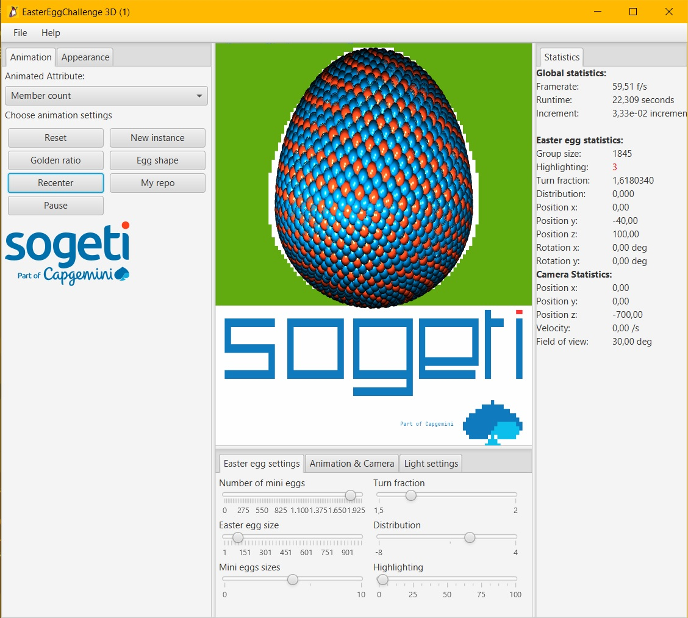
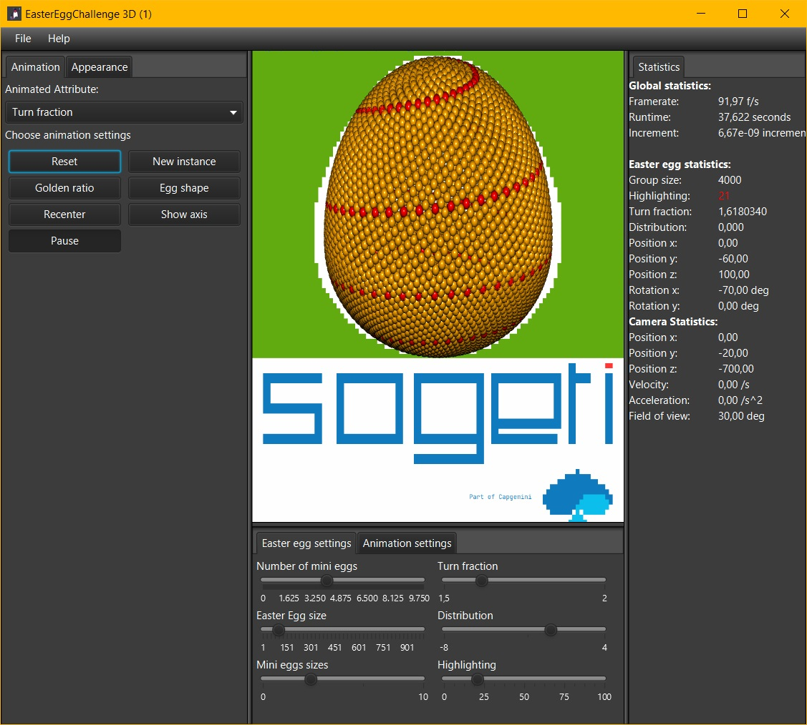
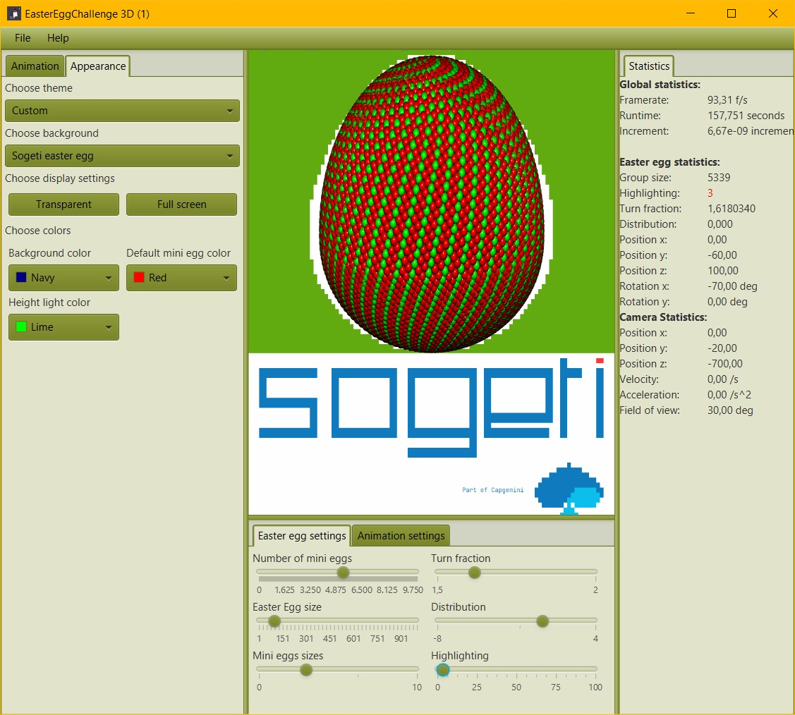
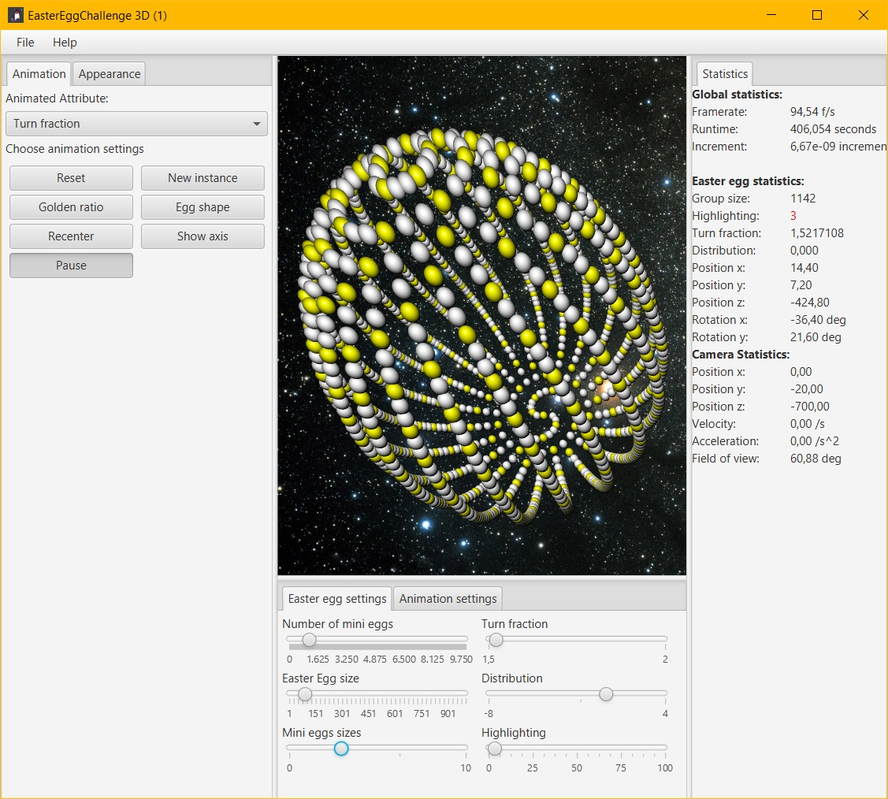

---


---
# Sogeti Easter Egg challenge 2021

A program to participate in the Sogeti EasterEgg Challenge. If you try it, maybe you will see the egg (sort off) hatch ;)

Use the mouse to move and rotate the egg (left click for up/down and left/right translation. 
Right mouse click for rotation, scroll for moving to front or back)

Use the keys for camera movement
- a -> left
- d -> right
- w -> up
- s -> down
- f -> front
- r -> rear

  
Press l to turn the rotation of the egg light on/off

Try all the sliders, dropdowns and buttons to see what happens!

Don't forget to click on the Sogeti logo and the red dot from the i ;)

Made By Hans Zuidervaart.


## About
In the app.properties file, you can tweak certain parameters of the program to suit your desires

---
## Screenshots

#### screenshot 1: A preview of the application


#### screenshot 2:


#### screenshot 3: 


#### screenshot 4: 


---

#### There are some rules to keep in mind:
- It is not the intention that the Easter egg block is made in a println (), and then printed out. That is why we only judge Easter eggs that are generated based on code algorithm.
  For example, what is not allowed:

```
 public void drawEgg() {
  println("   _   ");
  println(" _(\")_ ");
  println("(_ . _)");
  println(" / : \\ ");
  println("(_/ \\_)");
  }
  ```
- The code is written in Java
- The code can be found at GitHub and Fork the repo from https://github.com/SogetiEasterEgg/SogetiEasterEggChallenge2021
- This fork is shared with eastereggcompetition.nl@sogeti.com before 29-03-2021

--- 

## Motivation
For the creation of my egg, I was inspired by [this](https://gitlab.com/hanszt/fibonaccisim3d) simulation which 
on it's turn was inspired by [this](https://youtu.be/bqtqltqcQhw?t=345) Sebastian Lague coding adventure episode!

## Troubleshooting
Make sure the project is loaded as a maven project. If not: right click pom.xml -> add as Maven project
Make sure the src/main/resources folder is marked as resources root. If not: right click on folder resources -> Mark directory as -> Resources Root 

You can run the project from the Launcher class: 
Go to:

    nl.sogeti.view.Launcher and press the play button 

- [Getting started with JavaFX](https://openjfx.io/openjfx-docs/)
- [JavaFx and Java coding](https://edencoding.com/)

You can contact me if you have any questions: hans.zuidervaart@sogeti.com

---
## Enjoy!


---
## Sources
- [SogetiEasterEggChallenge2021](https://github.com/SogetiEasterEgg/SogetiEasterEggChallenge2021)
- [Points on a sphere](https://stackoverflow.com/questions/9600801/evenly-distributing-n-points-on-a-sphere/44164075#44164075)
- [JavaFx and Java coding](https://edencoding.com/)
---
